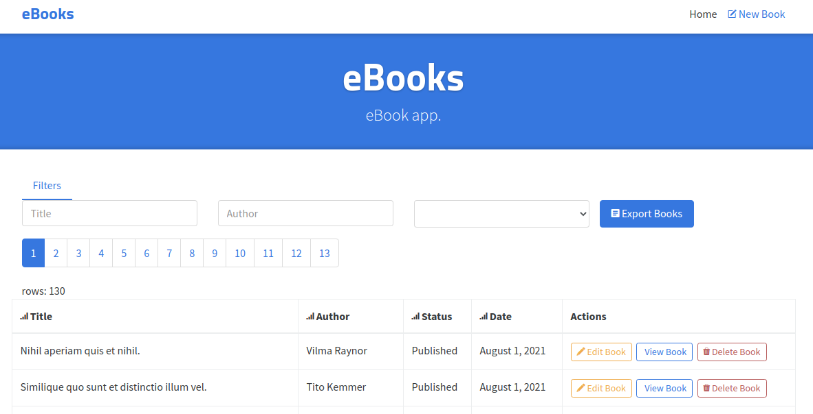

# 
> ### Books App with Laravel7 (CRUD, advanced patterns and more).

----------

# Getting started
Project demo is available at http://books.mohammadghamari.mtcdevserver4.com
                                     
## Installation

Please check the official laravel installation guide for server requirements before you start. [Official Documentation](https://laravel.com/docs/7.x/installation)

Clone the repository

    git clone git@github.com:developer2700/books.git

Switch to the repo folder

    cd books

Install all the dependencies using composer

    composer install

edit the env file and make the required configuration changes for database settings

    nano .env 

edit the env.testing file and make the required configuration changes for testing-database settings

    nano .env.testing 

Generate a new application key

    php artisan key:generate

Run the database migrations (**update database settings in .env before migrating**)

    php artisan migrate

Populate the database with seed data

    php artisan db:seed
    
Start the local development server

    php artisan serve

You can now access the server API_URL at : http://localhost:8000

Running the tests  

    php artisan test

**TL;DR command list**

    git clone git@github.com:developer2700/books.git
    cd books
    composer install
    nano .env 
    nano .env.testing 
    php artisan key:generate
    php artisan migrate
    php artisan db:seed
    php artisan serve    

## Front-end files

    1.cd resources/front-end-vujs
    2.check API_URL in resources/front-end-vujs/src/common/config.js file
    3.npm run serve
    4.access front-end page at: http://localhost:8080/ 
 
## Folders

- `resources/front-end-vujs` - Contains all the FRONT-END files 
- `app/Models` - Contains all the Eloquent models
- `app/Http/Controllers/Api` - Contains all the api controllers
- `app/Http/Repositories` - Repository and interfaces
- `app/Http/Middleware` - Contains the JWT auth middleware (not used in this version)
- `app/Http/Requests/Api` - Contains all the api form requests
- `app/Classes/Filters` - Contains the query filters used for filtering api requests
- `app/Classes/Paginate` - Contains the pagination class used to paginate the result
- `app/Classes/Transformers` - Contains all the data transformers
- `app/Services` - Contains all the ModelConvertor csv/xml classes
- `config` - Contains all the application configuration files
- `database/factories` - Contains the model factory for all the models
- `database/migrations` - Contains all the database migrations
- `database/seeds` - Contains the database seeder
- `routes` - Contains all the api routes defined in api.php file
- `tests/Feature/Api` - Contains all the api tests

## Environment variables

- `.env` - Environment variables can be set in this file
- `.env.testing` - Environment variables for testing-database can be set in this file

***Note*** : For running tests you should provide another database and enter the database_name in .env.testing file

----------

# Running API

Run the laravel development server

    php artisan serve

The api can now be accessed at

    http://127.0.0.1:8000/api/books
    http://127.0.0.1:8000/api/books/1

Request headers

| **Required** 	| **Key**              	| **Value**            	|
|----------	|------------------	|------------------	|
| Yes      	| Content-Type     	| application/json 	|
| Yes      	| X-Requested-With 	| XMLHttpRequest   	|
| Optional 	| Authorization    	| Bearer {JWT}      	|

----------
 